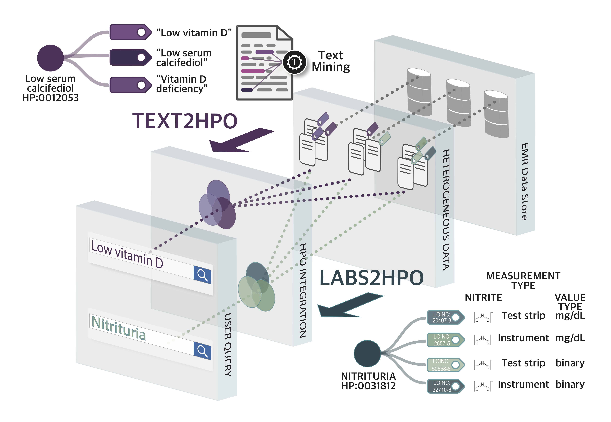

Electronic health records (EHRs) contain rich phenotype information that can be utilized to stratify diseases and to develop hypotheses. Despite the great potential of EHR data, patient phenotyping from EHRs is still challenging because the phenotype information is distributed in many EHR locations (laboratories, notes, problem lists, imaging data, etc.) and since EHRs have vastly different structures across sites. This lack of integration represents a substantial barrier to widespread use of EHR data in translational research. In the first phase of this project, we developed a method for mapping LOINC-encoded laboratory test results transmitted in FHIR standards to Human Phenotype Ontology (HPO) terms ([Zhang et al. (2019) npj Digital Medicine 2:3](https://www.nature.com/articles/s41746-019-0110-4)). In the current phase of the project, we will use the software to search for biomarkers in EHR data of participating CTSA centers. In future work, we will extend the resource to additional phenotype sources in the EHR.

* [Project description](pages/project_description.md)
* [App demo](https://octri.ohsu.edu/hpo_on_fhir/)
* [Repositories](pages/repositories.md)
* [Publications](pages/publications.md)
* [Engagement](pages/engagement.md)
* [Contact](pages/contact.md)

