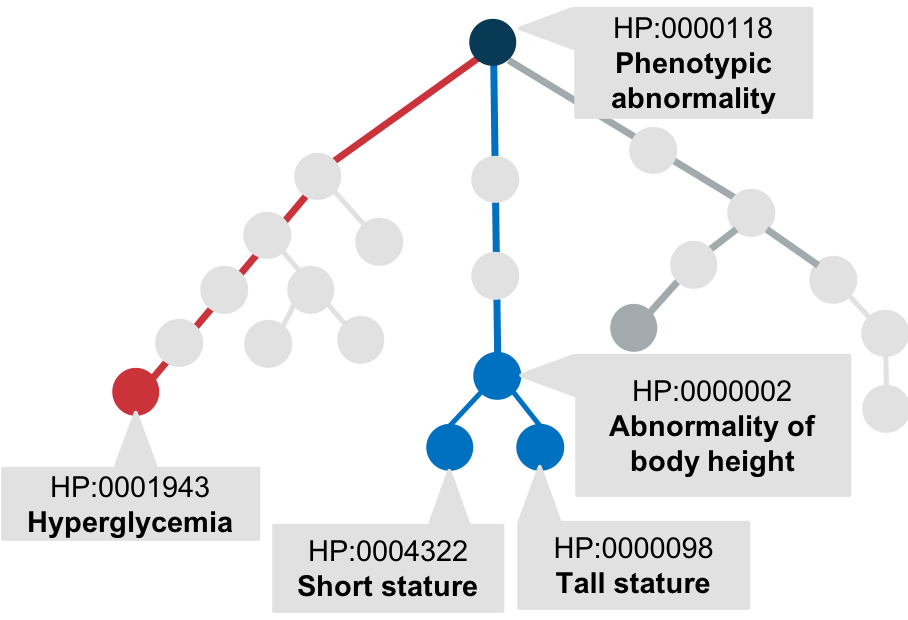

The [Human Phenotype Ontology](http://www.human-phenotype-ontology.org) (HPO) is a freely available and open source logically defined vocabulary for describing human abnormal phenotypes. The HPO has become the de facto standard for computational phenotype analysis in genomics and rare disease, being used by the NIH Undiagnosed Diseases Network, the 100,000 Genomes project, and many other academic, clinical, and commercial entities. The HPO currently contains 14,184 terms (February, 2019).

 hierarchical structure of Human Phenotype Ontology
 

A phenotype-driven approach opens up entirely new ways of mining EHR data for correlations that might be important in understanding disease pathophysiology, gender or age-differences, and biomarkers. It is important to develop clever ways of analyzing the data. We expect that many phenotype abnormalities might be highly correlated in all disease states, and thus identifying such an “obvious” correlation would not be an interesting result. For instance, Abnormal hematocrit and Abnormal hemoglobin level are expected to be highly correlated. Here, we propose adapting the approach taken to characterize [synergy networks](https://www.ncbi.nlm.nih.gov/pubmed/18234101) in expression data which was developed to find gene-gene interactions that are specifically associated with a phenotype (such as a particular cancer). The method is based on an information theoretic analysis of [multivariate synergy](https://www.ncbi.nlm.nih.gov/pubmed/17299419) that decomposes sets of genes into submodules each of which contains synergistically interacting gene. The method can be extended to phenotype to search for pairs of markers (HPO terms) that show mutual information conditional upon the presence of a specific diagnosis (e.g., an ICD9 code, or possible an eMERGE classification). The result would be a data driven way of defining pairs of features that show a surprising correlation in the presence of a disease — this might lead to the discovery of potential biomarkers (in this case, if one finds some HPO term in a person with some disease, then “synergy” would suggest the other HPO term of the pair would be more likely to be present than expected by chance). We also believe this might be a good opportunity to engage CTSA hubs in data exploration or the use of this approach/resulting derived data for DREAM challenges. 

A detailed Implementation protocol is available in this [GoogleDoc](https://docs.google.com/document/d/1ydNi9X8E-Fb-xdbEzN7mDq6vhrheXFcZ4xBOo30Qwoc/edit?usp=sharing). We are currently testing the implementations with a public dataset on intensive care unit patients (refer to [MIMIC_HPO](https://github.com/TheJacksonLaboratory/MIMIC_HPO/tree/master) ). 